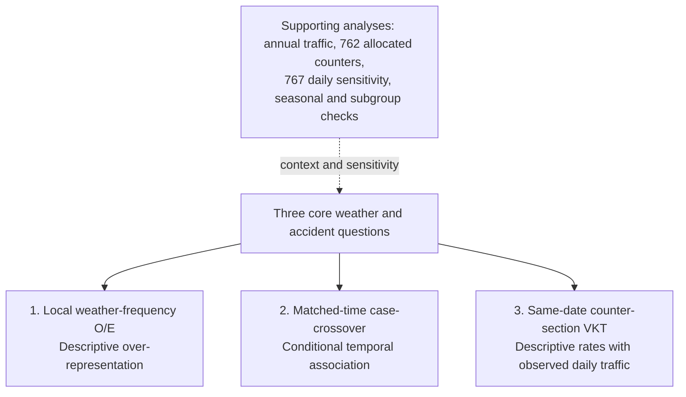

# Theory, implementation, and thesis audit of the three intended analyses

**Audit date: 13 September 2026. Read-only scientific audit.** This report uses the user's three-analysis hierarchy. “Kristján-style” means the operational same-date counter-section/VKT construction specified in the request, not an independently verified replication of an unspecified publication. Scientific code, prepared inputs, authoritative results, validation output, thesis sources, and PDF were not changed. Replays and diagnostic calculations used an isolated temporary directory.

**Verdict: do not give the implementation a blanket PASS.** The stored calculations and figures reproduce, and the main matched-wind OR reproduces. There are nevertheless genuine eligibility/provenance failures that ordinary validation does not detect.

| Audit area | Overall verdict | Reason |
|---|---|---|
| Primary weather-frequency O/E | **REVIEW** | Formula, samples, bins and figures pass. Temperature background/case eligibility fails consistency; unequal observation cadence also needs correction before calling record fractions exact time fractions. |
| Matched-time/case-crossover | **REVIEW** | Mean-wind/gust design and fits pass. Five live temperature controls fail reconstruction from the current cleaned source. |
| Same-day counter-section VKT | **FAIL** on the time-coverage requirement | Daily traffic, lengths, allocation arithmetic and the 613 sample reproduce, but row counting admits two days with only 52 distinct ten-minute slots. The full-day-count/daytime-weather assumption and one midnight match need explicit decisions. |
| Thesis alignment with the requested three-core hierarchy | **FAIL** | The thesis calls annual conditional Poisson the “main traffic result” and presents the 613 branch as a second supporting calculation. |

**PASS** means the stated requirement is satisfied by the current implementation and checked data. **REVIEW** means an assumption, boundary convention, missing safeguard, or interpretation requires a decision; it is not evidence by itself that the coefficient is wrong. **FAIL** means an explicit current inconsistency or requirement violation is demonstrated. A conservation PASS does not override an eligibility FAIL.

## 1. One-page analysis overview

Abbreviations: **A** = `data/analysis/`; **P** = `data/processed/`; **T** = `reports/main/tables/`; **F** = `reports/main/figures/`. Scripts below are relative to `src/`; detailed links follow.

| Analysis | Scientific question | Inputs | Script(s) | Method | Output | Current sample | Main assumption | Thesis role |
|---|---|---|---|---|---|---|---|---|
| **1. Weather O/E** | Over-represented relative to local weather frequency? | A/accidents, accident_conditions, weather_frequency | weather/frequency; analysis/oe_analysis; figures/oe_histo | Station × study-season observed/expected counts | T/weather_oe.csv; F/*_oe_panels.png | 6,259 per weather variable; severe/fatal subset 1,424 | Valid observation fractions represent local time fractions | **Core 1**, primary descriptive result |
| **2. Matched time** | Weather at accident versus comparable reference times? | P/rural injury matches + cleaned weather → A/case_control.csv | accidents/case_control; tables/case_control | Per-accident conditional logistic regression | T/matched_weather.csv | 6,257 cases per variable; 21,139 wind/gust and 21,144 temperature controls | Exchangeable reference times conditional on matching; comparable missingness | **Core 2**, calendar-matched comparison |
| **3. Same-day VKT** | Still more accidents in wind after using that date's observed traffic? | Daily PDF counts, annual lengths, road geometry, accidents, same-date weather | traffic/counter_sections; assign_counter_sections; counter_day_weather; counter_accidents; daily_vkt | Descriptive counts / allocated daily vehicle-km | P/traffic/daily_vkt.csv → A/daily_vkt.csv; F/weather_rate_annual.png | 848 assigned → 615 matched → 613 retained | Counter flow represents segment; full daily traffic allocated by valid 07–24 weather | **Core 3 intended**; currently subordinate in thesis |
| Corrected annual traffic | Within the same road/year/period, how do rates differ by wind? | A/road_rate, road_exposure | traffic/build_road_period; rate_weather; exports_traffic; tables/rate | Conditional Poisson + separate descriptive rates | T/wind_rate.csv; absolute_rate.csv | 5,125 exported; 5,122 likelihood | Seasonal average traffic follows weather time shares | Supporting; brief thesis comparison, details appendix |
| Allocated daily counter | Do within-counter/year rates differ using observed daily counts? | A/counter_wind, daily_traffic, accidents | tables/allocated_rate; analysis/traffic_rate | Conditional Poisson with allocated **vehicles**, not VKT | T/allocated_rate.csv | 762 | Uniform within-day traffic allocation; no length denominator | Supporting; appendix |
| Broad daily sensitivity | Are whole-day mean-wind conditions associated with counter-linked accidents? | A/accidents, daily_traffic, counter_locations | tables/counter_rate; counter_radius | Conditional Poisson; entire day assigned its mean-wind bin | T/day_rate*.csv; counter_radius.csv | 767 | Daily mean represents the day's exposure | Supporting; appendix summary, detailed tables repository |
| Seasonal/subgroup variants | Does the pattern vary with season, outcome, vehicle count or definition? | Subsets/extensions of the above | tables/wind_season, season_rate, severity and rate variants | Stratified summaries, interactions or subgroup fits | Corresponding seasonal/subgroup tables | Branch-specific; not a common sample | Adequate information, coherent contrasts, multiplicity restraint | Supporting; selected checks appendix, exploratory variants repository |

Study-season adjustment **inside the primary calculation is essential to core 1**. Separate seasonal panels/interaction models are supporting analyses, not additional core methods. Likewise, gust and temperature implement core weather questions with their own stated bins; they are not interchangeable samples or coefficients.

## 2. Intended hierarchy and current thesis mismatch

This is an evidence hierarchy, not three steps in one estimator. O/E, an odds ratio, and a descriptive estimated-VKT rate answer different questions; agreement in direction does not make their numerical magnitudes comparable.

The thesis's mathematical descriptions largely identify the methods correctly, but its emphasis does not implement the requested hierarchy:

- [content.tex:498](../reports/thesis/content.tex#L498): “The main traffic result is a conditional Poisson model” refers to the annual method.
- [content.tex:585](../reports/thesis/content.tex#L585) introduces same-day VKT as “A second daily-counter calculation”.
- [content.tex:782](../reports/thesis/content.tex#L782) gives the annual model its own Results subsection; [content.tex:811](../reports/thesis/content.tex#L811) groups both daily calculations under “Daily-Counter Checks”.
- [content.tex:823](../reports/thesis/content.tex#L823) describes the 613 construction in a few sentences and calls the daily results supporting checks. The dedicated `weather_rate_annual.png` and seasonal VKT figures are **not included** in the active thesis or appendix.
- Tables 4.1, 4.2 and 4.4 do include the 613 sample/result, but [evidence.tex:12](../reports/thesis/generated/evidence.tex#L12) also treats the annual comparison as prominent supporting evidence. The sample appendix focuses on 767/762, not the 848 → 615 → 613 branch.

**Minimum thesis change after approval:** name these three core analyses explicitly; give same-day VKT its own Methods and Results subsection and its actual selection explanation; call annual Poisson and the two other daily models supporting. This is a role/estimand clarification, not permission to call the descriptive 613 branch a regression or a causal per-vehicle risk model. No thesis text was edited in this audit.

## 3. Core 1 — primary weather-frequency O/E

### Theory and implementation

For weather variable (v), station/study-season stratum (g), and bin (b), the implementation is

\[
p_{gb}=n_{gb}/n_g,\qquad E_{gb}=A_g p_{gb},\qquad
OE_b=\frac{\sum_g O_{gb}}{\sum_g E_{gb}}.
\]

`A_g` is recomputed for the selected outcome and variable; the serious/fatal calculation therefore uses its own subset total. This is an indirect standardisation of accident counts against local weather frequencies. It is **not** a rate ratio against the calm bin: each O/E bar compares observed counts with its own expected count. Its null comparison is accident occurrence proportional to local weather frequency, conditional on station and study season.

The denominator has no traffic, vehicle, journey, or road-length exposure. O/E > 1 supports descriptive over-representation, not an individual vehicle's risk or a causal weather effect. Time-varying traffic, year trends within pooled station/seasons, selection into weather matching, changing station observation coverage, and other weather-related conditions can affect the comparison.

| Requirement | Verdict | Evidence and precise qualification |
|---|---|---|
| 6,259 qualifying accidents | **PASS** | 6,414 unique rural injury events; 6,259 meet each current f, fg and temperature scenario's match conditions. The same qualifying IDs currently underlie the three variables. |
| ≤20 km and ≤5 min | **PASS** | [oe_analysis.py:213](../src/analysis/oe_analysis.py#L213) filters variable-specific distance/time fields; current matched-case maximum distance 19.977497 km and time difference 5 minutes. Temperature has separate match columns. |
| Station × study-season expected frequencies | **PASS** | [oe_analysis.py:235](../src/analysis/oe_analysis.py#L235) groups station and season. No year column occurs in the primary A/weather_frequency.csv; year adjustment is a separate supporting result. |
| Correct study seasons | **PASS** | Winter Dec–Mar, Spring Apr–May, Summer Jun–Sep, Autumn Oct–Nov. These are study seasons, **not** conventional three-month meteorological seasons. Frequency and export month mappings agree for all 12 months. |
| Mean-wind bins | **PASS** | Left-closed: [0,5), [5,10), [10,15), [15,20), ≥20 m/s. Prepared 20–25 and ≥25 counts are combined before analysis. |
| Gust bins | **PASS** | [0,5), [5,10), [10,15), [15,20), [20,25), [25,30), ≥30 m/s. Prepared 30–35 and ≥35 counts are combined. |
| Temperature bins | **PASS** numerically | <−6, [−6,−3), [−3,0), [0,3), [3,6), [6,9), [9,12), ≥12°C. The matched/annual temperature models intentionally retain 12–15 and ≥15. |
| Comparable temperature validity in numerator and background | **FAIL** | Accident matches require [−30,30]°C; cleaning retains [−60,50]°C and frequency counts every finite retained temperature. There are 11,807 current observations outside [−30,30], including **8,289 in contributing primary temperature station/seasons**. See §6. |
| Observed and expected counts | **PASS** | Recalculated all 30 variable × outcome × period panels from current analysis inputs; every value reproduces the authoritative table within floating-point tolerance. All-year counts appear below. |
| Expected counts conserved within strata | **PASS** | Maximum absolute stratum error (7.11\times10^{-15}) accidents; observed counts reconstruct exactly. Both outcome populations reconstruct their own totals. |
| No silent join loss in the current data | **PASS** | Event/condition IDs are unique and their sets agree; eligible = analysed for every panel. No current eligible station/season is lost. |
| Prevent silent loss if background keys disappear | **FAIL** as a guard | [oe_analysis.py:272](../src/analysis/oe_analysis.py#L272) uses an inner background join. An isolated missing-key probe through the full `analyse` function returns 6,239 of 6,259 eligible accidents without raising, because observed/expected reconstruction still passes for the reduced set. `analyse` does not require eligible = analysed. |
| Serious/fatal is a subset, not an additional disjoint population | **PASS** | Current domain is {1,2,3}; serious/fatal IDs are the 1,424 IDs with codes 1/2, all within 6,259. Primary plots do not add the overlapping outcomes. [wind_oe_comparison.py:107](../src/tables/wind_oe_comparison.py#L107) deliberately selects the all-injury row only. |
| Figures use exactly the authoritative table | **PASS** | [oe_histo.py:21](../src/figures/oe_histo.py#L21) reads T/weather_oe.csv. Isolated rerenders of all three primary PNGs are byte-for-byte identical to live figures; plotted heights and annotations come directly from table ratios/counts. |
| Bin notation in temperature figure | **REVIEW** | [oe_histo.py:77](../src/figures/oe_histo.py#L77) renders finite temperature intervals with two closed brackets `[a,b]`; numerical classification is `[a,b)`. This is a label inconsistency, not incorrect numerical bin membership. |
| Observation counts represent equal time increments | **FAIL** for the literal ten-minute assumption | The current cleaned source contains **8,724 timestamps off the ten-minute grid**; all rows receive equal weight in [frequency.py:96](../src/weather/frequency.py#L96). Their effect cannot be dismissed simply because global counts are small; they are concentrated by station/date. |
| O/E described as descriptive, not vehicle-level risk | **PASS** | Thesis [content.tex:365](../reports/thesis/content.tex#L365) gives this formula and calls O/E descriptive; no primary O/E confidence intervals are presented. Local frequency standardisation does not remove all spatial/seasonal confounding or unequal travel exposure. |

All-year observed/expected counts from the authoritative table (expected counts rounded here only):

| Variable | Bin | All injury O | All injury E | Severe/fatal O | Severe/fatal E |
|---|---|---:|---:|---:|---:|
| f | 0-5 | 3,156 | 3339.117924 | 743 | 773.923683 |
| f | 5-10 | 2,123 | 2068.845377 | 476 | 470.497095 |
| f | 10-15 | 695 | 670.199949 | 148 | 142.877006 |
| f | 15-20 | 217 | 149.240460 | 45 | 30.287406 |
| f | >=20 | 68 | 31.596290 | 12 | 6.414810 |
| fg | 0-5 | 1,976 | 2206.017546 | 461 | 512.257008 |
| fg | 5-10 | 2,233 | 2146.245764 | 531 | 498.105494 |
| fg | 10-15 | 1,186 | 1188.033810 | 258 | 264.467459 |
| fg | 15-20 | 520 | 487.592004 | 100 | 102.671880 |
| fg | 20-25 | 206 | 164.137848 | 40 | 33.228019 |
| fg | 25-30 | 77 | 48.725936 | 25 | 9.633384 |
| fg | >=30 | 61 | 18.247092 | 9 | 3.636756 |
| temperature | <-6 | 224 | 265.252134 | 47 | 51.372592 |
| temperature | -6--3 | 402 | 420.733621 | 68 | 80.760399 |
| temperature | -3-0 | 948 | 779.008769 | 156 | 151.137293 |
| temperature | 0-3 | 1,217 | 1122.638266 | 233 | 228.065950 |
| temperature | 3-6 | 808 | 1137.032790 | 176 | 255.324504 |
| temperature | 6-9 | 944 | 1135.895237 | 264 | 285.737618 |
| temperature | 9-12 | 927 | 904.670084 | 254 | 239.804195 |
| temperature | >=12 | 789 | 493.769099 | 226 | 131.797450 |

Totals in each variable: **6,259 all-injury observed and expected; 1,424 serious/fatal observed and expected**. Mean wind ≥20 is 68 / 31.596290 = **2.152151**, shown as **2.15** in the thesis. This confirms the currently reported calculation; it is not approval to retain an inconsistent temperature or cadence policy.

## 4. Core 2 — matched-time / case-crossover

### Theory, reference selection, and what is controlled

With one case in matched set (i), the conditional likelihood contribution is

\[
L_i(\beta)=\frac{\exp(x_{i,case}^{T}\beta)}
{\sum_{t\in S_i}\exp(x_{it}^{T}\beta)}.
\]

Conditioning removes each set's intercept. This is precisely the no-intercept, group-specific conditional logistic structure used by [tables/case_control.py:39](../src/tables/case_control.py#L39), rather than ordinary logistic regression with an accidental shared baseline. The installed implementation is Statsmodels **0.14.6**; the [official ConditionalLogit documentation](https://www.statsmodels.org/stable/generated/statsmodels.discrete.conditional_models.ConditionalLogit.html) describes the same conditional-intercept construction.

Reference targets are the other occurrences of the same weekday and clock time in the **same calendar month/year**, before and after the case as available. Fixed calendar strata are the appropriate time-stratified approach to avoiding referent-selection overlap bias; that does not guarantee absence of all confounding. See [Janes, Sheppard & Lumley (2005)](https://pubmed.ncbi.nlm.nih.gov/15546133/).

The design fixes the accident's station and calendar context (year, month, weekday, hour/minute/second), with weather measurements allowed within five minutes of each target. It removes set-level fixed baseline differences and controls these recurring calendar patterns by design. It does **not** measure whether the same person/vehicle was travelling at a control time, or control actual traffic volume, closures, unusual travel, road treatment, changing road surface, correlated weather in a univariable fit, holidays within weekday classes, or other daily shocks. “Controls individual driver characteristics” would overstate what these external station-time records establish. A conditional OR is not directly an observed rate per vehicle-km.

“Non-accident times” is convenient but imprecise: reference times are selected by the calendar, not screened as accident-free across all roads/vehicles. The current audit finds zero exact station/target-time collisions with another retained case, but the algorithm does not guarantee that property. Prefer **matched reference times**; do not filter reference dates based on observed accidents after the fact without a design justification.

| Requirement | Verdict | Evidence and qualification |
|---|---|---|
| One stratum per accident | **PASS**, per exposure | IDs are `stratum_id`; each exposure/ID has exactly one case and ≥1 control. Different exposure fits use the same IDs separately, not three cases pooled into one model. |
| Same weekday + clock time + month/year controls | **PASS** | [accidents/case_control.py:26](../src/accidents/case_control.py#L26) enumerates the correct calendar targets. Every stored control passes direct year/month/weekday/hour/minute/second comparisons to its case and is on another date. |
| Same intended station | **PASS** | Wind/gust use the case's matched wind station; temperature uses its temperature station. All stored strata have one station; case values/stations match prepared accident rows. |
| ≤20 km | **PASS** for current data | Both candidates and cases filter the case-station distance. Maximum observed case distance is 19.977497 km. |
| ≤5 min controls | **PASS** for wind/gust; **REVIEW** for provenance | Candidate floor/ceil grid times are constrained to five minutes. Wind/gust rows exactly reconstruct from current clean weather. The five unmatched temperature rows correspond to raw observations within five minutes, but not observations in the current canonical cleaned file. |
| ≤5 min cases enforced locally | **REVIEW** | Current case observations all meet the rule through upstream matching. [case_control.py:143](../src/accidents/case_control.py#L143) does **not** itself filter/check the case time-difference field, and the output omits the actual matched weather timestamp and time delta. |
| Conditional logistic implementation | **PASS** | Binary outcome, accident grouping, no global intercept, reference dummy omitted, `exp(beta)` and exponentiated Wald CI calculated correctly. Continuous exposure divided by 5 gives per-5-unit coefficients. |
| Correct references | **PASS** | Wind 0–5; gust 0–10; temperature 0–3°C. Bins are detailed below. These references intentionally differ from some supporting coarse models. |
| Exact current sample accounting | **PASS** | See table below. Of 6,259 eligible cases, IDs **3592896 and 4127671** have no usable controls and are excluded, leaving 6,257. Exports preserve all prepared matched-time rows exactly. |
| Reproduce current mean-wind headline | **PASS** | Refitting the current CSV with existing code reproduces OR **1.608910**, CI **1.380927–1.874532**, displayed **1.61 (1.38–1.87)**. |
| Independent check of likelihood theory | **PASS** at reported precision | A separate one-case softmax likelihood and analytic information matrix give OR **1.608777**, CI **1.380811–1.874379**: identical published rounding. The small full-precision difference is optimisation tolerance, not a different likelihood. The independent score maximum is (1.77\times10^{-8}); coefficients are not claimed identical to every decimal. |
| All live temperature controls reproducible from canonical input | **FAIL** | The current generator recreates 21,139 temperature controls, not the live 21,144. Five raw temperature observations survive only in the stored case-control input despite their rows being removed from cleaned weather as frozen-wind intervals. Details below. |
| Transparent exclusion accounting and no inappropriate “complete-case” restriction | **REVIEW** | Sets with 1–4 available controls are retained correctly; all-zero-control cases are dropped. Missing controls can still select dates according to weather/data availability. There is no durable per-target missingness/source audit in the export. |
| Design interpretation in thesis | **PASS** with wording review | [content.tex:405](../reports/thesis/content.tex#L405) correctly describes temporal/station matching and daily confounding limits. “Matched non-accident times” should be qualified as above; current source consistency for temperature cannot receive PASS. |

| Exposure | Eligible cases | Retained case strata | Controls | Cases with 1 / 2 / 3 / 4 controls | Sets informative for categorical exposure |
|---|---:|---:|---:|---|---:|
| Mean wind | 6,259 | 6,257 | 21,139 | 9 / 56 / 3,750 / 2,442 | 5,563 |
| Gust | 6,259 | 6,257 | 21,139 | 9 / 56 / 3,750 / 2,442 | 4,742 |
| Temperature, live | 6,259 | 6,257 | 21,144 | 9 / 54 / 3,749 / 2,445 | 6,075 |

All sets have case/control outcome variation. Sets with no **categorical exposure** variation remain in the stored sample but provide no information about categorical coefficients; this does not turn 6,257 into an incorrectly counted case sample. All 6,257 sets have continuous-value variation. Standard errors are model-based; weather correlation across station-times and sparse categories warrant restraint. A covariance sensitivity is optional work, not grounds to silently replace this fit.

Categorical bins: wind 0–5, 5–10, 10–15, ≥15; gust 0–10, 10–15, 15–20, 20–25, 25–30, ≥30; temperature <−6, −6–−3, −3–0, 0–3, 3–6, 6–9, 9–12, 12–15, ≥15. Finite intervals are left-closed/right-open.

### Exact five-control provenance mismatch

| Accident stratum | Reference target | Station | Raw observation | Temperature °C |
|---|---|---:|---|---:|
| 4870748 | 2015-01-01 16:42 | 31399 | 2015-01-01 16:40 | −2.06 |
| 6113396 | 2019-12-23 11:09 | 33357 | 2019-12-23 11:10 | −4.17 |
| 6133242 | 2020-01-06 15:06 | 33643 | 2020-01-06 15:10 | 0.07 |
| 7539690 | 2024-11-30 08:50 | 35305 | 2024-11-30 08:50 | 0.04 |
| 7610347 | 2025-02-27 16:13 | 35107 | 2025-02-27 16:10 | 3.17 |

All five raw rows have `f = fg = 0`. They map to recorded frozen intervals in `archive/generated_diagnostics/weather_frozen_zero_intervals.csv`; none has a current cleaned weather observation within ±5 minutes. Current [case_control.py:74](../src/accidents/case_control.py#L74) reads only `weather.parquet`, so it cannot produce these five rows. All other case/control weather values and keys reproduce; the five affected sets also have correspondingly different control-count metadata. The fresh prepared reconstruction has **82,188** rows versus **82,193** live; all cases, wind controls, and gust controls are unchanged.

A valid temperature can physically exist during a frozen-wind interval, so this is **not proof those five temperatures are meteorologically wrong**. It is proof that the live input and the declared/common clean-source policy differ. The audit establishes that discrepancy and its raw/QC trace, not the undocumented operation that originally inserted/retained the rows. Decide the common temperature-source policy before regenerating temperature-dependent results; do not silently preserve an undocumented exception.

## 5. Core 3 — Kristján-style same-day traffic/VKT

### What the code actually estimates

For counter-section (s), date (d), variable (v), and bin (b):

\[
V_{sd}=Q^{24h}_{sd}L_s,\qquad
\widehat V_{sdvb}=V_{sd}\frac{n^{07-24}_{sdvb}}{n^{07-24}_{sdv}},\qquad
R_{vb}=10^8\frac{\sum_{sd}A_{sdvb}}{\sum_{sd}\widehat V_{sdvb}}.
\]

Multiplying a traffic count by segment length supplies distance-based vehicle exposure; this agrees dimensionally with the [FHWA segment crash-rate formulation](https://highways.dot.gov/safety/local-rural/roadway-departure-safety-manual-local-rural-road-owners/appendix-c-crash-rate), with kilometres here rather than miles. The code uses actual per-date counts, not annual ADU/SDU/VDU traffic. Annual records contribute **lengths**, which does not turn this into the annual traffic model.

The **whole 24-hour count** is distributed across weather observed during 07:00–23:50; no factor of 17/24 and no observed hourly count enters the calculation. For a complete regular grid this assigns `Q/102` vehicles to each valid ten-minute observation. With missing weather, it renormalises over the retained observations. Thus the arithmetic conserves the full daily total, but it does not measure true 07–24 VKT. Accident numerators exclude 00–07 accidents. An unknown daytime-traffic fraction may vary with station, season and weather, so there is no justified universal scale correction.

**Interpretation: descriptive accidents per estimated vehicle-km under the stated full-day-to-daytime allocation**, not a fully observed daytime accident risk. Observed traffic decline on a windy date is reflected in `Q`; weather-dependent traffic timing within that date is not. Pooling also leaves road/date composition and other confounders uncontrolled. No regression, conditional likelihood, offset model, or adjusted coefficient is fitted in this branch.

### Line-by-line requirement audit

| Requirement | Verdict | Implementation and checked evidence |
|---|---|---|
| Actual observed daily traffic | **PASS** | [traffic/daily.py:28](../src/traffic/daily.py#L28) parses the six 2019–2024 PDFs. [pdf_parser.py:142](../src/traffic/pdf_parser.py#L142) sums directional channels. Reaggregation of **1,033,659** retained source-channel rows exactly reconstructs daily traffic and channel counts in **774,274** canonical counter-day rows; no duplicate channel/date keys. This is a numerical source-channel check, not a claim of independent visual re-entry of every PDF cell. |
| Physical site and exact road/year linkage | **PASS**, with spatial assumptions | [counter_sections.py:44](../src/traffic/counter_sections.py#L44) groups channel positions on the same registered road/year within a **20 m full-span** tolerance. This 20 m threshold is not the 20 km weather radius. Distinct sites split the official section at midpoints. |
| Appropriate accident section assignment | **PASS** | [assign_counter_sections.py:129](../src/traffic/assign_counter_sections.py#L129) requires registered road/year, projects the accident onto that road's geometry, rejects >100 m offset, and requires its along-road station to lie within the counter-section. This is not “nearest counter anywhere”. |
| Length included, no overlapping duplication of road length | **PASS** | [counter_sections.py:106](../src/traffic/counter_sections.py#L106) divides official lengths at neighbouring-counter midpoints. Summed subsegment lengths match whole sections within (3.56\times10^{-15}) km. Counter flow representing the entire assigned subsegment remains an assumption. |
| (VKT = daily\ count \times length) | **PASS** | [counter_day_weather.py:96](../src/traffic/counter_day_weather.py#L96) uses `traffic_vehicles * counter_section_length_km`; matching is by date, counter-section and year-derived ID. |
| Daily traffic effectively allocated over 07–24 | **PASS** for the requested approximation; **REVIEW** for interpretation | [daily_vkt.py:53](../src/traffic/daily_vkt.py#L53) allocates **all** daily VKT using the 07–24 fractions. This is not an observed 17-hour traffic count and is stronger than merely “hourly data unavailable”. |
| Weather denominator uses that same date | **PASS** | [counter_day_weather.py:110](../src/traffic/counter_day_weather.py#L110) aggregates actual observations by station/date and [line 181](../src/traffic/counter_day_weather.py#L181) joins that date. The rebuilt panel from the current clean source reproduces the live 653,646 rows. No annual or climatological bin frequency is substituted. |
| Observations counted as equal ten-minute intervals | **FAIL** | The aggregator counts rows, without enforcing grid alignment or one observation per ten-minute slot. 28 counter-section days have >102 observations; one station-day has **985**. This overweights densely sampled portions of a day. See the exact examples below. |
| Accident classified by its actual accident-time wind/gust/temperature | **PASS** for nearest-observation rule | [counter_accidents.py:22](../src/traffic/counter_accidents.py#L22) constructs ±5-minute candidates; [daily_vkt.py:87](../src/traffic/daily_vkt.py#L87) bins the matched values. All 613 retained events have positive denominator exposure in their assigned variable/bin on their date. |
| Numerator and denominator station identical | **PASS** | [counter_accidents.py:77](../src/traffic/counter_accidents.py#L77) explicitly checks station agreement. The same check was repeated against allocated exposure keys. |
| Distance meaning is unambiguous | **REVIEW** | Stored `weather_station_dist_km` in this branch is **counter-to-weather-station**, copied at [counter_accidents.py:81](../src/traffic/counter_accidents.py#L81), not accident-to-station. Current matches happen to satisfy both: actual accident/station maximum **18.408040 km**, stored counter/station maximum **17.681475 km**; zero current accidents exceed 20 km. The second condition is not explicitly enforced by this branch. |
| Same-date/window boundary for accident weather | **REVIEW** | ID **6131900**, 2020-01-17 23:56, uses station 3463 at **2020-01-18 00:00** (4 minutes later), while its denominator uses January 17, 07–24. It meets the nearest-observation tolerance but not a literal same-calendar-date/window rule. Decide/document the midnight exception or constrain candidates; it is not a station mismatch. |
| 90% same-day coverage threshold | **FAIL** as a time-coverage guarantee | Constants correctly compute `ceil(0.90 * 102) = 92`, separately by variable. However, [counter_day_weather.py:184](../src/traffic/counter_day_weather.py#L184) tests raw row counts, so two counter-section days on one date with only **52 unique slots** pass. |
| 848 → 615 → 613 fully explained | **PASS** | Exact sequential reasons, source IDs and the two final coverage failures are given below. Isolated section construction, assignment and accident rematching reproduce live inputs. |
| Daily VKT conserved across bins | **PASS** | All eligible date/section keys reconstruct, including zero-accident sections. Maximum error (5.83\times10^{-11}) vehicle-km. Total wind/gust VKT **7,337,474,559.87825**; temperature **7,337,152,718.86825** because variable-specific eligible days differ. |
| No silent present-day record loss at count/exposure joins | **PASS** for current data | All final IDs and bins account for the 613 events; no event lacks a positive same-day/bin denominator. **REVIEW safeguard:** inner valid-day joins and a pooled exposure-left count join do not independently fail on every possible unmatched event/bin; preserve anti-join audits. |
| Rates per estimated VKT, no hourly traffic falsely implied | **PASS** in formula and figure axes; **REVIEW** prose precision | [daily_vkt.py:134](../src/traffic/daily_vkt.py#L134) multiplies count/exposure by (10^8); `weather_rate.py` labels estimated vehicle-km. Thesis [content.tex:597](../reports/thesis/content.tex#L597) identifies Q as 24-hour traffic and says hourly traffic is not observed, but should state explicitly that all of Q is allocated to the restricted weather window. |
| Descriptive if no regression is fitted | **PASS** | `traffic/daily_vkt.py` only groups, allocates and divides; it contains no model fit. Do not transfer annual Poisson RRs/CIs or the 762 model's adjusted interpretation to this branch. |
| Severity accounting | **PASS**, distinct from O/E | The two stored outcomes are disjoint minor injury (code 3) and severe/fatal (1/2). Their accident counts sum to 613 for every weather variable. The all-injury rate is their summed count over the **one shared denominator**; do not add that denominator twice. |
| Figures correspond to this branch | **PASS** | `weather_rate.py` reads A/daily_vkt.csv. Isolated annual and three seasonal figure rerenders match live PNG bytes exactly. These plots show minor and severe/fatal separately, not the overlapping all-injury/severe O/E panels. |

### Exact sample selection

The source table has 126,607 accidents. Restricting to 2019–2024 gives 41,689; excluding 34,777 urban/unclassified accidents gives 6,912 rural accidents; excluding 5,049 non-injury/unknown records leaves **1,863 rural injury accidents**. The source's explicit `{1,2,3}` selection reproduces the same 2019–2024 rural injury population used by the other branches.

| Step, in execution order | Excluded at this step | Remaining |
|---|---:|---:|
| Rural injury accidents, 2019–2024 | — | 1,863 |
| No counter-section on registered road in that year | 994 | 869 |
| Road projection farther than 100 m | 15 | 854 |
| No registered-road geometry | 5 | 849 |
| Outside defined counter-section extent | 1 | **848 assigned** |
| Accident before 07:00 | 67 | 781 |
| Counter/weather station distance missing or >20 km | 2 | 779 |
| No same-date counter-panel record | 83 | 696 |
| Nonpositive traffic, among otherwise available dates | 0 | 696 |
| No clean accident-time wind/gust observation within five minutes | 81 | **615 matched** |
| Insufficient same-day weather coverage | 2 | **613 retained** |

The first four assignment reasons are disjoint reasons produced by the assignment loop; their displayed order is for accounting, not an alternative filtering algorithm. Later exclusions are classified in actual matching/coverage order, so totals are not double-counted.

The final two exclusions apply to wind, gust and temperature alike:

| Accident ID | Date/time | Valid observations | Required |
|---|---|---:|---:|
| 6664643 | 2021-12-05 16:29 | 84 | 92 |
| 7572591 | 2024-12-16 10:58 | 46 | 92 |

Thus **613 = 32.90% of the 1,863 rural injury accidents in the available daily-traffic years**. Most exclusions arise before weather fitting, especially the 994 with no exact road/year counter-section. The sample is not small because a regression discarded uninformative strata: **there is no regression here**. It is geographically and temporally selected and is not a national accident-rate sample.

The denominator contains **549,452** positive-traffic, coverage-eligible wind/gust section-days over **1,713 year-specific counter-section IDs**; temperature has **549,391** days. These include days without accidents. The larger pre-eligibility panel has 653,646 section-days across 1,963 year-specific IDs. A year-specific counter-section ID count is not a count of distinct physical national sites across all years.

### Concrete cadence failure and why conservation does not catch it

The full clean-weather scan found 8,724 off-grid timestamps among 230,458,950 rows. Station 6300 contributes 8,369. In the current counter-day panel, 28 section-days across 11 station-dates exceed the supposed maximum 102 observations. These are extra distinct timestamps, not duplicate station/time keys in the examples examined.

- **Station 6300, 2019-06-12:** 985 distinct observations across 102 ten-minute slots; only 95 observations fall exactly on the ten-minute grid. Treating all 985 as equal ten-minute units changes within-day weighting.
- **Station 6300, 2019-06-11:** 491 observations cover only **52** distinct ten-minute slots, including 48 exact-grid observations. Both `2019:1-d2:8614-8614` and `2019:305-01:204-204` nevertheless pass the ≥92-row test, adding **95,845.20 + 4,660.59 estimated VKT**. There are **no matched accident IDs on the cadence-discrepant section-days**; the demonstrated effect here is on eligible denominator days and weights.

Fractions computed as bin rows / all rows always sum to one, even when rows are not equal-duration observations. Therefore the VKT conservation PASS cannot establish correct time coverage or correct time shares. A canonical cadence/slot policy must be decided once and applied consistently to backgrounds, same-day exposure and matching; simply adding an upper-bound assertion will detect this problem but will not resolve it.

For reference, the **current**, unrevised all-injury wind summary is:

| Mean wind | Accidents | Estimated VKT | Rate per 100 million estimated VKT |
|---|---:|---:|---:|
| 0-5 | 298 | 4,352,844,239.549 | 6.846098 |
| 5-10 | 187 | 2,335,791,037.480 | 8.005853 |
| 10-15 | 86 | 551,072,167.870 | 15.605941 |
| 15-20 | 32 | 86,465,306.042 | 37.009063 |
| >=20 | 10 | 11,301,808.937 | 88.481411 |

The ≥20 category has only ten accidents. This descriptive pattern cannot establish that wind has an independently adjusted or causal effect after accounting for every aspect of actual traffic. This audit has not promoted a cadence-corrected result or determined how approved fixes would change the thesis conclusion.

## 6. Cross-cutting implementation risks and exact mismatches

| Risk | Verdict | Exact finding | Minimum response worth considering |
|---|---|---|---|
| Duplicated distance/time thresholds | **REVIEW** | 20 km/5 min appear in match_weather, case_control, road_common, counter_accidents, allocated_rate and validation. Some distances refer to accident–station, others counter–station or accident–counter. Earth-radius constants also differ slightly (6371.0 vs 6371.0088). | Share constants only where semantics match; use explicit distance names. Do not collapse distinct linkage rules into one predicate. |
| Duplicated rural/injury selection | **REVIEW** | [match_weather.py:48](../src/accidents/match_weather.py#L48) uses Rural + `meidsli < 4`; [assign_counter_sections.py:100](../src/traffic/assign_counter_sections.py#L100) repeats Rural + `isin([1,2,3])` from all.csv. They agree on current IDs but would differ for 0/negative unexpected codes. | Assert the permitted severity domain and equality of the shared source population; use an explicit common eligibility predicate when safely isolated. |
| Inconsistent temperature validity | **FAIL** | Cleaning [clean.py:31](../src/weather/clean.py#L31) retains −60 to 50; [frequency.py:106](../src/weather/frequency.py#L106) accepts all finite t. Accident matching, CCO controls, annual temperature numerators, and same-day numerator/denominator use −30 to 30. In contributing primary strata, 8,058 background observations are below −30 and 231 above 30. | Agree one **analysis eligibility** rule for both numerator and background. Raw cleaning may retain a broader archive range, but analysis denominators must apply the declared rule. Recompute affected temperature outputs only after approval. |
| Inconsistent temperature source policy | **FAIL** | Five live CCO temperature controls originate in raw rows excluded by wind frozen-run QC and cannot be rebuilt by current code. | Choose whether temperature follows common wind-cleaned availability or a documented independent source. Minimum under current policy: rebuild CCO from current clean weather and verify temperature-dependent outputs. Do not invent an undocumented fallback. |
| Repeated study seasons and bins | **REVIEW** | export_common, weather.frequency, wind_season and exports_traffic repeat month maps; Fall/Autumn naming is translated in several places. O/E upper bins are repeated instead of importing existing OE constants. Current month maps and intended coarse/fine distinctions agree. | Reuse existing definitions where genuinely identical; retain model-specific bins/references. Add boundary checks for 5/15/20/30 m/s and 0/12/15°C and all months. |
| Equal observation-duration assumption unchecked | **FAIL** | Source has off-grid observations; frequency and same-day code count records without time-grid validation. The same-day completeness failure is demonstrated, not hypothetical. | Fail fast on duplicate/off-grid/unexpected-cadence records, then implement an approved ten-minute/time-weighting policy. Verify source-to-denominator conservation in time as well as in rows. |
| Midnight/window boundary | **REVIEW** | One final same-day accident uses next-day midnight weather while its exposure is the preceding date's 07–24 panel. | Explicitly decide whether ±5 min can cross day/window boundaries. If not, enforce date/window before choosing the match and audit the exclusion. |
| Preparation performs analysis | **REVIEW**, architectural | [prepare.py:27](../src/prepare.py#L27) runs `traffic.daily_vkt`, which calculates final weather rates in P, before exports. `analyze` mainly plots this branch if the exported table exists. | Document this dependency and require a fresh panel/rate build before validation. Moving modules/layers is not needed before submission. |
| Exports perform scientific transformations | **REVIEW**, architectural | exports_weather pools frequency counts and constructs totals; exports_traffic allocates exposure, bins accidents, selects positive exposure/accident strata, and constructs season/temperature model inputs. These are scientific transformations, not format-only copies. | Name them explicitly in provenance and test their data contracts; no broad exporter refactor is justified for this audit. The CCO and daily_vkt exports themselves preserve the numerical prepared records (daily_vkt changes row order). |
| Stale-cache/freshness | **REVIEW**; current CCO temperature discrepancy is **FAIL** above | Annual cache reuse is existence-based unless the rebuild flag is passed; `prepare` does not pass it. `daily_weather.py:40` checks cached method/date span but not source fingerprints. Daily preparation is skipped by default. The annual cache was corrected previously; the same-day chain now reproduces current inputs. | Minimal submission safeguard: explicit fresh-build commands plus a verified input-hash manifest, or fail-on-mismatched fingerprints. Do not represent the prior annual correction as automatic cache invalidation. |
| O/E joins may silently remove strata | **FAIL** safeguard | The missing-background probe drops 20 eligible accidents while all reduced-sample totals still conserve. | Require every eligible station/season key and observed nonzero-count bin to have denominator support, and require eligible IDs = analysed IDs before writing results. |
| Other joins hide reasons or resolve duplicates silently | **REVIEW** | CCO inner-joins controls; same-day matching inner-joins dates and weather; daily rates inner-join valid dates. Source road links/PDF channels use `drop_duplicates(... keep='last')`, and weather readers keep first station/time rows. Legitimate exclusions are not always written as reason-coded audits. | Preserve anti-join IDs/reasons; reject conflicting duplicates rather than treating all duplicates as benign. Check event-bin exposure keys before aggregation. No unexplained current 613-ID loss was found. |
| Validation checks outputs rather than important source invariants | **REVIEW** | [validation/traffic.py:170](../src/validation/traffic.py#L170) checks categories, declared method string, sample 613 and direction; it does not verify unique slots or actual matching date. [validation/models.py:19](../src/validation/models.py#L19) does not replay control sources. | Add targeted invariant/provenance checks, not another hardcoded positive-result assertion. The existing 36 tests and validation pass despite the failures identified here. |
| Supporting temperature and traffic outputs inherit shared problems | **REVIEW** | Corrected annual outputs reproduce their approved source, but that does not resolve the cadence or temperature analysis-domain issues identified here. The 762/767 branches use other prepared daily summaries and were not independently rebuilt from raw weather in this audit. | Retain their supporting status; review affected dependencies if a shared QC/cadence policy changes. Do not infer their validity merely from the same-day replay or prior annual snapshot. |

### Two important statistical qualifications

1. **Full-day Q versus daytime accidents is an explicit estimand limitation.** The theory of exposure-based rates requires matching the numerator's population/time and the denominator's exposure. The requested full-Q allocation is implementable and conserved, but cannot be described as observed daytime VKT. Multiplying by 17/24 would merely replace one unsupported assumption with another unless the traffic profile justifies it.
2. **Valid temperature bounds must apply symmetrically to the analysed population.** Broader raw-data storage limits are not intrinsically wrong. The failure is counting an analysis-domain observation in the background that the same analysis would refuse at an accident time. This particularly affects tail definitions. The audit has not changed −30/30 or −60/50, and does not choose new bounds based on which estimates look preferable.

## 7. Supporting analyses: purpose and recommended location

These are recommendations for the requested hierarchy, not edits already made.

| Supporting analysis | Question answered | Why not one of the three core analyses? | Recommended disposition |
|---|---|---|---|
| Corrected annual conditional Poisson | Does the wind rate association persist within road-section/year/traffic-period strata using broad seasonal-average traffic? | It substitutes SDU/VDU/derived VHDU and period weather shares for actual accident-date traffic; it is not core 3. It estimates conditional RRs, unlike core 1 or descriptive core 3. | **Thesis:** one clearly labelled supporting result. **Appendix:** detailed RRs, serious/fatal and official VDU+SDU sensitivity. **Repository:** full outputs/provenance. Current sample 5,125 exported / 5,122 likelihood; 20–25 RR 2.34 (1.72–3.17). |
| 762 allocated daily-counter Poisson | Does a within-counter/year comparison support high wind when observed daily vehicles are allocated using full-day wind counts? | It uses allocated vehicles without counter-section length, a different 24-hour window/coverage threshold and linkage, and a regression. It does not implement the requested 07–24 section-VKT construction. | **Appendix**, with at most a short cross-reference in the main text. Current ≥15 vs 0–10 RR 3.62 (2.65–4.94). Do not call its denominator vehicle-km. |
| 767 broad daily sensitivity | Is the daily mean-wind association sensitive to broader nearest-counter linkage/distance? | Entire counter-day traffic and accidents are classified by the **daily mean**, not accident-time weather or same-date time shares over fine bins; no section length. It is a different exposure assignment, not five extra cases in the same 762 estimator. | **Appendix:** compact sample/distance sensitivity. **Repository:** detailed fine/coarse outputs. Explicitly distinguish it from 762 and 613. |
| Annual/daily seasonal and vehicle-count variants | Does a descriptive or model pattern differ across seasons/subgroups? | They subdivide or extend a core/supporting method rather than provide a fourth independent design. Sparse cells and different reference bins limit direct comparison. | **Appendix** for prespecified, interpretable checks; **repository only** for exhaustive variants. Use interaction tests for claims of differences, not “significant here but not there”. |
| Matched wind×season and joint wind/temperature | Does temporal association vary by season or survive adjustment for measured temperature? | They extend core 2 rather than replace its base design. Joint complete-case sets and bins require separate accounting. | A short **thesis** statement if central to the question; technical tables in **appendix**. Reassess temperature-source consistency before promoting temperature-dependent updates. |
| Serious/fatal occurrence panels versus severity-among-accidents model | Does severe accident occurrence show the pattern, or does severity composition among recorded accidents differ? | These are different outcomes/estimands; the severity-composition logistic model conditions on an accident having occurred. | Keep the all-injury/severe O/E panels with core 1 as requested; place detailed occurrence subgroups and severity-composition models in **appendix**. Do not mix their interpretations. |
| Detailed daylight, radius, temperature-tail and alternative-bin explorations | How sensitive are selected results to context or a different definition? | They do not supply the missing actual hourly traffic or an independent causal identification strategy. | **Repository only** unless a specific, prespecified check resolves an important thesis limitation. Avoid expanding the submission with all available analyses. |

Retain caution for corrected annual serious/fatal 20–25 RR **1.88 (0.88–4.02)**; it does not establish an elevated rate in that bin. The annual ≥25 and same-day ≥20 intervals remain sparse. No supporting result should be used to bypass a failed eligibility/provenance requirement in a core analysis.

## 8. Minimum changes worth making before submission — proposed only

This is a bounded correction list, not a repository refactor. Scientific policy decisions and dependent regeneration require approval of this audit first.

| Priority | Proposed minimum change | Files/functions | Acceptance evidence |
|---|---|---|---|
| **1 — required** | Establish consistent temperature **analysis** eligibility and source policy. Under the declared current clean-source policy, remove the undocumented five-control discrepancy by rebuilding, not manual CSV edits. | weather/frequency; accidents/match_weather and case_control; temperature exposure exports; relevant validation | Same numerator/background validity; every case/control traceable to the declared source; regenerated affected temperature estimates compared before/after. |
| **1 — required** | Enforce a canonical temporal grid/weighting contract before interpreting observation counts as time. Resolve station 6300's dense observations; apply completeness to unique intended slots. | weather/clean or an explicit preparation normalisation step; weather/frequency; traffic/counter_day_weather | ≤102 unique 07–24 slots, no unexpected duplicate/off-grid contribution, explicit coverage denominator; the two 52-slot section-days cannot pass a 92-slot rule. Rebuild all affected descendants after approval. |
| **1 — required guard** | Reject unmatched eligible O/E strata/bins and require eligible/analysed IDs to agree. Preserve reason-coded same-day and CCO selection audits. | analysis/oe_analysis; accidents/case_control; traffic/counter_accidents and daily_vkt; validation | Missing-background probe raises; all current legitimate exclusions remain explained; no event disappears merely because a join found no denominator key. |
| **2 — decision + small fix** | Decide and enforce/document the midnight tolerance and the full-Q allocation assumption. Name the counter/station distance correctly; add a separate accident/station check if that is required. | traffic/counter_accidents; thesis Methods; export metadata | ID 6131900 has an explicit boundary treatment; no implication of observed hourly or daytime-only counts; distance columns state their actual geometry. |
| **2 — source provenance** | Keep actual matched weather timestamp, delta and source in CCO preparation/audit; validate case ≤5 min locally. Add a source hash manifest/freshness check for submission builds. | accidents/case_control; exports_accidents; relevant cache builders/validation | Current input can be rebuilt exactly; controls cannot survive a source/QC replacement undetected. No need to move the entire pipeline into new modules. |
| **2 — presentation** | Align the thesis with the three intended analyses; promote the same-day branch's method, sample flow and descriptive result. Correct temperature half-open interval notation. | content.tex and existing table/figure generators after approval | Three core questions map to three methods/results; annual/762/767 labelled supporting; generated numerical tables remain generator-driven. |
| **3 — optional cleanup** | Import already-existing identical constants and add small boundary/domain tests. | existing season/bin/radius definitions only | No numerical output changes except explicitly approved scientific corrections. Keep genuinely different windows, references and distance concepts distinct. |

**Not recommended before submission:** broad module moves, redesigning all exporters, merging the three estimators, adding a regression to the 613 branch merely for symmetry, or changing reference bins to make estimates look comparable. A cluster-covariance sensitivity could be considered separately; it is not a silent replacement for the prespecified matched-time fit.

## 9. Verification record and limits

- Protected scientific files were hashed and their modification times recorded before the audit; final verification is recorded below. The repository's pre-existing annual-correction working changes were preserved.
- Current primary O/E: the full 230,458,950-row cleaned source reproduces all **27,633 pooled frequency rows** and the exported frequencies; all **30 panels** recalculated; current eligible/analysed counts and stratum totals checked; all three figure files rerendered identically in isolation.
- CCO: calendar, IDs, stations, values, sample accounting and all current CSV model fits checked. Wind/gust prepared inputs reproduce from clean weather; five temperature-control discrepancies are explicitly identified. Independent conditional-likelihood calculation agrees with the headline at published precision.
- Same-day VKT: counter-section construction and geometry assignment reproduced; all **653,646** counter-day panel rows rebuilt from current inputs; accident weather replay gives the same 615 matches; final rates and exported values reproduce (the export reorders rows). Allocation and sample audits are independent of the retained model/summary counts.
- Source scans: all **230,458,950** cleaned rows checked for off-grid timestamps and temperature-domain differences; five control observations traced to raw weather and recorded frozen intervals.
- Daily traffic: source-channel sums and counts verified; seven O/E/VKT PNG rerenders are byte-identical to live figures.
- All **36 existing tests passed**. Validation passed with its report directed to the temporary directory. This demonstrates that current tests are insufficient to detect the methodological/provenance failures, not that those failures are harmless.
- The supporting annual correction was inspected as the current state; the 762/767 and every optional variant were **not** independently rebuilt from raw sources in this three-core audit. Their classification is based on inspected implementation and current retained outputs. No unperformed source validation is claimed.
- No corrected cadence/temperature policy was promoted, no authoritative result was changed, and no conclusion about the numerical effect of those future fixes is asserted. These require a controlled before/after comparison after approval.

Audit calculations, scripts, detailed ID traces and replay outputs are retained locally at
`/private/tmp/analysis_theory_audit_hpjsv0_a/` (temporary, not an authoritative results directory).
The important decisions, exact discrepancies and sample accounting are included in this report so they do not depend on retaining that temporary directory.

**Final preservation verification: all 398 protected scientific/input/result/thesis files retained their original SHA-256 hashes and modification times. Only this new audit document was added to the repository during this audit.**
